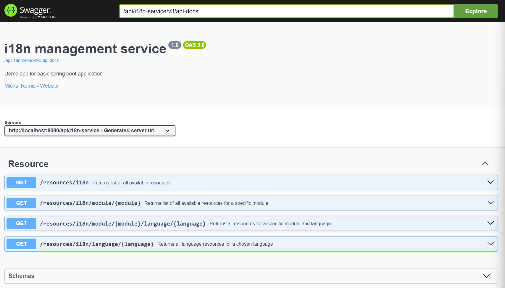

### i18n Service example

### Purpose

    Centralizing default resources for easy management across languages and modules.
    Enabling selective overrides for customized values per client, without duplicating the entire resource set.

### Format of the i18n resource (table i18n_messages)

| Name        | Type                        |
|-------------|-----------------------------|
| id          | varchar(36)                 |
| customer_id | varchar(36)                 |
| locale      | varchar(100)                |
| module      | varchar(100)                |
| key         | varchar(255)                |
| message     | varchar(255)                |
| creation_ts | timestamp without time zone |
| update_ts   | timestamp without time zone |

## How it works - example

Resources are stored with fields for locale, module, key, message, and timestamps.
Clients can either use the default values or override specific keys.
Below are examples of the data in i18n_messages table:

#### Default Resources

| id | customer_id | locale | module    | key                       | message         |
|----|-------------|--------|-----------|---------------------------|-----------------|
| 1  | NULL        | en-US  | app-login | login                     | Sign in         |
| 2  | NULL        | en-US  | app-login | welcome.by                | by {{customer}} |
| 3  | NULL        | en-US  | app-login | welcome.startButton.label | Start           |
| 9  | NULL        | sk-SK  | app-login | login                     | Prihlásiť sa    |
| 10 | NULL        | sk-SK  | app-login | welcome.by                | od {{customer}} |
| 11 | NULL        | sk-SK  | app-login | welcome.startButton.label | Štart           |

### Client-Specific Overrides (for `customer-1`) - only welcome by and login are overridden

| id | customer_id | locale | module    | key        | message                    |
|----|-------------|--------|-----------|------------|----------------------------|
| 20 | customer-1  | en-US  | app-login | login      | Sign in - override         |
| 21 | customer-1  | en-US  | app-login | welcome.by | by {{customer}} - override |
| 22 | customer-1  | sk-SK  | app-login | login      | Prihlásiť sa - override    |
| 23 | customer-1  | sk-SK  | app-login | welcome.by | od {{customer}} - override |

Fetching defaults for english language::

```
GET /i18n/app-login/en-US
```

would result in:

```json
[
  {
    "locale": "en-US",
    "module": "app-login",
    "messages": {
      "login": "Sign in",
      "welcome.by": "by {{customer}}",
      "welcome.startButton.label": "Start"
    }
  }
]
```

Fetching with overrides for english language:

```
GET /i18n/app-login/sk-SK?customer_id=customer-1
```

would result in:

```json
[
  {
    "locale": "en-US",
    "module": "app-login",
    "messages": {
      "login": "Sign in - override",
      "welcome.by": "by {{customer}} - override",
      "welcome.startButton.label": "Start"
    }
  }
]
```

### Technical details

| Tech Stack                        |
|-----------------------------------|
| Java 17                           |
| Maven                             |
| Spring Boot 3                     |
| Postgres SQL                      |
| Flyway                            |
| Docker                            |
| SpringDoc OpenAPI UI (Swagger UI) |
| Hibernate                         |

### Make sure to have installed

* [Git](https://git-scm.com/downloads)

* [JDK 17 or later](https://adoptium.net)

* [Maven 3.8.8 or later](https://maven.apache.org/download.cgi)

* [Docker](https://www.docker.com/)

### DB Structure

Flyway is used for automatic DB migration on application start.

* [Flyway DB Migration scripts](src/main/resources/db/migration)

### Build & Test:

```
mvn clean install
```

### Swagger UI:



This project uses OpenAPI for documentation

Swagger UI can be found under

```
{server-url}/api/i18n-service/swagger-ui/index.html
```

#### For local testing, click [here](http://localhost:8080/api/i18n-service/swagger-ui/index.html) after running the application to redirect to Swagger UI

### YAML API Specification:

Specification can be downloaded under

```
{server-url}/api/i18n-service/v3/api-docs.yaml
```

#### For local testing, click [here](http://localhost:8080/api/i18n-service/v3/api-docs.yaml) after running the application to download the file

## Reason behind this proof of concept

While I agree that this is really simple implementation on first sight,
the whole purpose of this was that I wanted to do a proof of concept for some common problem
that would allow me to demonstrate a future-proof solution.

Some of the advantages that might not be obvious at first glance:

#### Centralized Resource Management

- **Simplified Updates**: All language resources are stored in one location, making it easier to update, maintain, and
  manage translations across multiple modules.
- **Consistency**: Ensures uniformity in translations and messages across the application, reducing discrepancies and
  improving user experience.

#### Dynamic Overrides

- **Customer-Specific Customization**: Clients can easily override default resources without affecting others. This
  flexibility allows businesses to tailor their application to meet specific customer needs or branding guidelines.
- **Efficient Development**: Developers can implement changes for specific clients quickly, enhancing responsiveness to
  customer requests and minimizing deployment cycles.

#### Horizontal Scaling

- **Increased Availability**: By centralizing the i18n service, it can be deployed across multiple servers or instances,
  improving availability and reducing the risk of downtime.
- **Load Distribution**: The service can handle increased traffic by distributing requests across multiple instances,
  ensuring smooth performance even during peak usage times.
- **Microservices Architecture**: If implemented as a microservice, the i18n service can independently scale based on
  demand, allowing for more efficient resource allocation.

#### Vertical Scaling

- **Improved Response Times**: By optimizing the data retrieval and caching mechanisms, vertical scaling can lead to
  faster response times for fetching localized resources, enhancing the overall user experience.

#### Localization Flexibility

- **Support for Multiple Languages and Modules**: The architecture can easily accommodate new languages and modules as
  the application grows, providing a scalable solution for future expansion.
- **Dynamic Configuration**: The ability to add or update resources dynamically allows for quicker adaptations to market
  changes or customer requirements.

#### Reduced Duplication

- **Minimized Redundancy**: By having a centralized resource store, duplicate translations can be eliminated, reducing
  the amount of data stored and streamlining data management.

#### Better Monitoring and Analytics

- **Insights into Usage Patterns**: Centralized logging and monitoring can provide insights into how different languages
  and resources are used, enabling data-driven decisions for further improvements.

#### Easier Testing and Validation

- **Simplified QA Processes**: A single source of truth for resources allows for easier testing and validation of
  translations, ensuring that updates do not break existing functionality.